# 조인

## 1. 개요

### 1.1. 조인의 개념

- 조인은 관계형 데이터베이스에서 두 개 이상의 테이블을 묶어서 하나의 결과물을 만드는 프로세스.
- 보통 기본키-외래키 연결된 테이블을 묶어서 하나의 결과물로 나타내는 데 사용됨.
- 조인 연산은 테이블 간의 카티션 프로덕트를 수행하고 특정 조건에 맞는 레코드만 선택함.
- 조인은 표현 방법에 따라 암시적, 명시적으로 나뉨
- 암시적 표현 방법 예제

<div align='center'>
    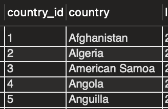<br>
</div>
    
    
<div align='center'>
    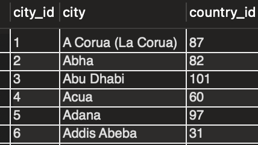<br>
</div>

    - 위의 두 테이블에서 조인을 이용하여 각 국가에 속한 도시 정보를 구성할 수 있음.

    ```sql
    SELECT country, city FROM city A, country B
    WHERE A.country_id = B.country_id;
    // 암시적 표현 방법
    // A, B 테이블을 카티션하고
    // 조건문으로 국가 코드가 같은 레코드를 뽑아냄
    ```

<div align='center'>
    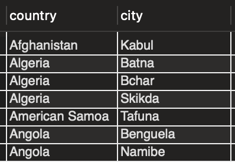<br>
</div>
    
- 명시적 표현 방법은 아래에서 기술할 INNER, LEFT, … JOIN 과 같은 명령어를 사용.

## 2. 기본 조인 유형

<div align='center'>
    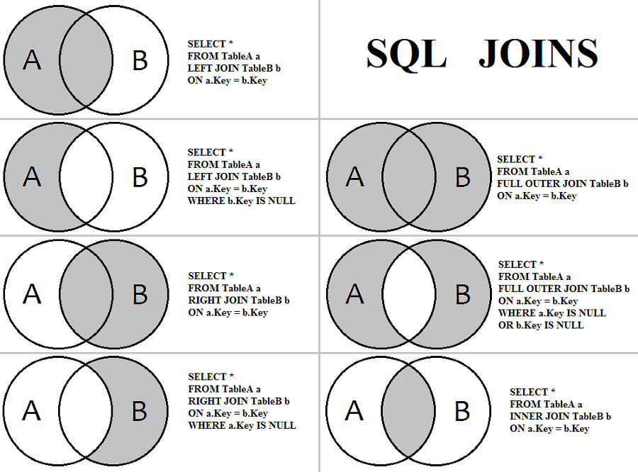<br>
</div>

조인 유형 요약

- 사용될 예제 테이블

<div align='center'>
    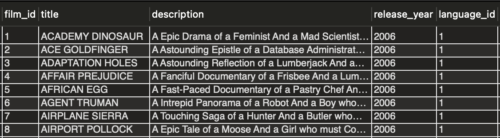<br>
</div>
    
    
<div align='center'>
    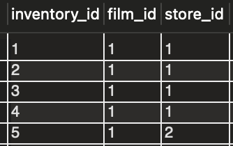<br>
</div>

### 2.1. INNER JOIN, NATURAL JOIN

- INNER JOIN
  - 두 테이블 간 특정 열의 공통된 값을 기준으로 결합.
  - 가장 흔하게 사용 되는 조인 유형
  - EQUI JOIN과 혼용되기도 함.
  - 예제
    - film 테이블과 inventory 테이블의 공통 속성 film_id을 이용
    ```sql
    SELECT film.film_id, film.title, inventory.inventory_id
    FROM film INNER JOIN inventory
    ON film.film_id = inventory.film_id;
    ```

<div align='center'>
    <br>
</div>
        
        
- NATURAL JOIN
    - NATURAL JOIN은 자동으로 테이블 간 동일한 열들을 찾아 결합.
    - 예제
        
        ```sql
        SELECT film.film_id, film.title, inventory.inventory_id
        FROM inventory
        NATURAL JOIN film;
        ```
        
        - 이전 Inner join 과 마찬가지로 같은 테이블의 같은 속성을 뽑아냄.
        
<div align='center'>
    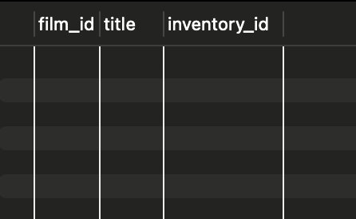<br>
</div>
        
        결과 테이블 (아무런 결과가 나오지 않는다..)
        
        - 위와 같은 결과의 이유는 film_id를 제외하고 두 테이블 간 공통된 속성이 존재하기 때문 (last_update: 데이터가 수정된 시간을 기록하는 속성)
        
<div align='center'>
    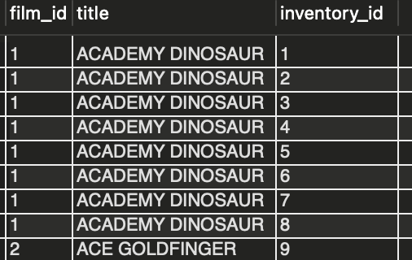<br>
</div>
        
        
        - 삭제 후 공통된 속성이 film_id로 유일하기 때문에 정상적으로 출력
    - 위와 같이 natural join은 공통 속성을 명시하지 않기 때문에 예기치 못한 결과를 출력하기도 한다.
    - 가급적이면 Inner join으로 조건을 명시하는 것이 좋다.

### 2.2. LEFT JOIN, RIGHT JOIN

- 지정한 쪽 (left, right)의 테이블의 모든 행을 결과에 포함한다.
- 반대쪽 테이블과 매칭되는 행이 있다면 그대로 결과에 포함되지만 그렇지 않다면 반대쪽 테이블의 속성을 NULL로 표시한다.
- 예제 (LEFT JOIN)
  ```sql
  SELECT film.film_id, film.title, inventory.inventory_id
  FROM film
  LEFT OUTER JOIN inventory ON film.film_id = inventory.film_id;
  ```

<div align='center'>
    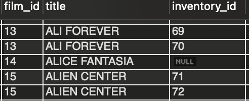<br>
</div>


### 2.3. FULL OUTER JOIN

- FULL OUTER JOIN은 양쪽 테이블의 모든 행을 매칭여부와 상관없이 표시한다.
- 따라서, 행에 따라서 왼쪽 테이블, 오른쪽 테이블 관계없이 매칭되지 않으면 NULL 값이 표시된다.
- 예제
  ```sql
  SELECT film.film_id, film.title, inventory.inventory_id
  FROM film
  FULL OUTER JOIN inventory ON film.film_id = inventory.film_id;
  // 아쉽게도 MySQL은 FULL OUTER JOIN을 지원하지 않음.

  // LEFT JOIN, RIGHT JOIN을 UNION하는 방식으로 구현해야함.
  // 아래 쿼리..
  SELECT film.film_id, film.title, inventory.inventory_id
  FROM film
  LEFT JOIN inventory ON film.film_id = inventory.film_id

  UNION

  SELECT film.film_id, film.title, inventory.inventory_id
  FROM film
  RIGHT JOIN inventory ON film.film_id = inventory.film_id
  WHERE film.film_id IS NULL;
  ```

<div align='center'>
    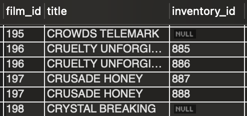<br>
</div>
    


### 2.4. CROSS JOIN

- cross join은 두 테이블의 각 행이 조합되어 가능한 모든 경우를 결과로 출력한다.
- 즉, 두 테이블을 단순 카티션 프로덕트한 결과를 출력한다.
- 예제
  ```sql
  SELECT COUNT(*)
  FROM inventory
  CROSS JOIN film;
  ```
  - film 테이블의 행 개수가 1000, inventory의 행 개수가 4581개 이므로 이론상 4,581,000개의 행이 결과로 출력된다.

<div align='center'>
    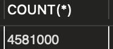<br>
</div>
    


## 3. 조인 최적화
