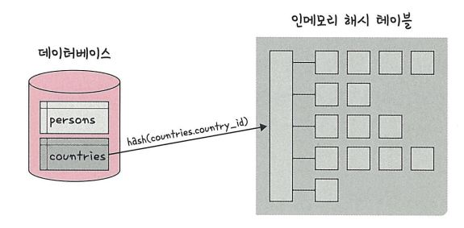
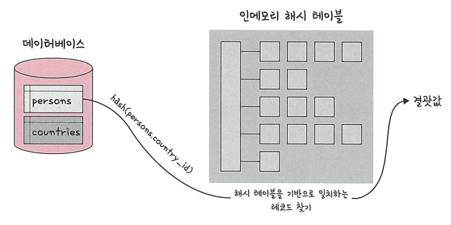

# 조인

앞서 다 설명하겠지만, 설명을 위해 간략히 다루도록 함

## 조인이란

2개 이상의 테이블을 묶어 하나의 결과물을 만드는 것

## 조인의 원리

2개 이상의 테이블에 대해, 모든 행에 대해 가능한 조합을 모두 구한 뒤,
셀렉트 연산으로 조인 연산의 조건을 만족하는 행만을 추출하는 식으로 작동한다.

## 조인 방식의 종류

역시 이전 발표에서 다 설명했을 테니 간략히 다룸

- natural join
- outer-join
    - left join
    - right join
    - full join
- inner-join

## 조인 연산의 구현

### 중첩 루프 조인, NLJ: Nested Loop Join

중첩 for문과 같은 원리로 조인을 하는 방법

랜덤 접근에 대한 비용이 많이 증가하므로, 대용량 테이블에선 사용하지 않는다

각 행마다 조건이 맞는 행을 찾아 조인을 실행한다.

### 정렬 병합 조인

각 테이블이, 조인할 필드의 기준으로 정렬이 되어 있을 때 구현이 가능하다.

병합 정렬(merge sort)가 하는 것처럼, 각 테이블마다 처음부터 원소를 훑으면서 조건에 맞는 행을 합치는 식으로 작동한다.

행의 수가 많을 때 유리한 조인 방식이다.

### 해시 조인

해시 테이블을 기반으로 하는 조인 방식이다.

조인하려는 테이블을 R, S라고 하고, 조인을 위해 비교하는 R의 속성 A와 S의 속성 B가 있다고 가정하자.

두 테이블 중 크기가 작은 테이블을 고른 뒤, 그 테이블의 속성 A(또는 B)를 해싱하여 메모리에 담아둔다. 이 때, 해시값이 같은 행들을 같이 보관하며, 이 해시값들을 보관하는 자료구조를 해시 버킷(hash bucket)이라고 부른다.  
이 단계를 <u>분할 단계</u>라고 부른다.

아래와 같이 인메모리 해시 테이블, 해시 버킷에 저장되는 것을 확인할 수 있다.

이후, 남은 테이블의 속성 B(또는 A)를 해싱하면서, 같은 해시 값에 존재하는 행들에 대해 조인 연산을 수행한다.  
이 단계를 <u>조사 단계</u>라고 한다.

해시 조인을 활용하면, 메모리를 크게 아끼면서 조인 연산을 수행할 수 있다.  
조인 연산을 위해 비교할 속성의 값이 해시값으로 크게 줄어든다.  
이상적인 경우, 메모리에서 바로 연산이 가능해진다.

하지만 대부분의 경우, 해시값이라 하더라도 메모리에 모든 데이터를 저장하는 것은 힘들다. 이를 해결하기 위해 분할-해시 조인 또는 혼합형 해시 조인을 활용한다.

여기서는 분할 해시 조인의 일반적인 경우와, 혼합형 해시 조인의 과정을 설명한다.

### 분할 해시 조인

조인 속성에 대해, 분할 해시 함수를 사용하여 $M$개의 파티션으로 분할한 뒤, 대응되는 파티션들의 각 쌍을 조인하는 식으로 작동한다.

테이블 $R$과 $S$가 메모리에 담기 힘들 만큼의 데이터를 가지고 있다고 가정한다.

테이블을 여러 파티션으로 나누기 위해, 분할 해시 함수를 사용한다. 이 분할 해시 함수에서 나올 수 있는 해시값들의 개수가 $M$개라고 가정한다.

테이블 $R$과 $S$의 연산을 위해, 각 테이블의 데이터를 분할 해시 함수를 이용하여  $M$개의 파티션으로 나눈다.
이를 $R_1, R_2, ... R_M$과 $S_1, S_2, ... , S_M$으로 각각 부른다.  

이후 각 파티션에 대해 $M$번의 해시 조인이 수행된다. 당장 연산하지 않는 파티션들은 보조기억장치에 저장된다.

파티션끼리의 조인은 $M_i$와 $S_i$끼리만 이루어진다. 분할 해시 함수를 통해 동일한 값들을 가진 행끼리 모인 것이므로, 해당 파티션끼리만 조인 연산을 수행하면 된다.

각 파티션들에 대해 해시 조인 시, 분할 해시 함수가 아닌 기존의 해시 함수 또는 다른 해시 함수를 사용한다.  
해시 조인 시, 분할 해시 함수를 다시 사용한다면, 해당 파티션 내 모든 행의 해시 값이 동일하게 나오므로 제대로 된 연산이 불가능하기 때문이다.

### 혼합형 해시 조인

위 분할 해시 조인과 비슷하지만, 한 쪽 테이블만 먼저 파티셔닝해둔 뒤 진행한다.

$R$을 먼저 파티셔닝했다고 가정하자. 우선 $R_1$을 메모리에 두고, 나머지는 보조기억장치에 저장해둔다.

이후 $S$를 한 행씩 분할 해싱을 수행한다.  

만약 해싱한 행이 $R_1$과 같은 해시 값을 가진다면, 즉시 $R_1$에 대해 조인 연산을 수행한 후 결과를 저장한다. 그렇지 않다면, 해당하는 파티션 $S_i$에 저장해둔다.

$S$에 대해 파티셔닝을 모두 마치고 나면, $M_1$과 $S_1$에 대한 조인이 파티셔닝 과정에서 수행된다. 결과적으로, 보조기억장치를 통한 연산이 한 단계 줄어든다.

이후, $M_2$와 $S_2$ 파티션에서부터 해시 조인을 마저 수행하면 된다.

---
# 참고자료
- 면접을 위한 CS 전공 지식 노트
    - 조인의 원리 - 226p
- 데이터베이스 시스템 7판 - Elmasri & navathe
    - 이항관계 연산: 조인과 디비전 연산 - 204p
    - 이항관계 연산: 외부 조인 연산 - 216p
    - 조인 연산의 구현 - 608p

    https://blogshine.tistory.com/567
    