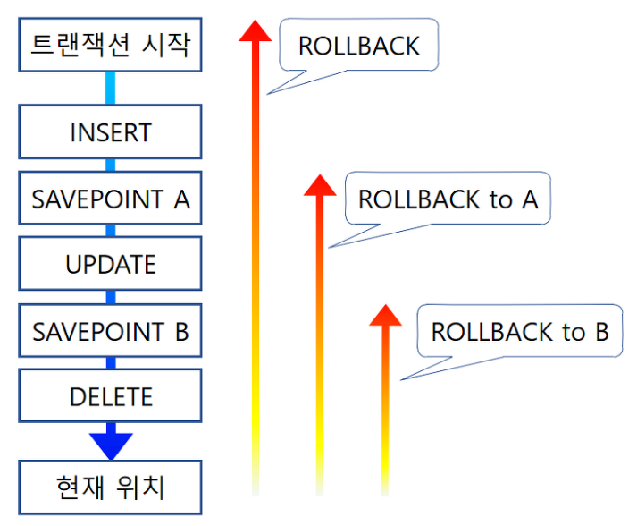
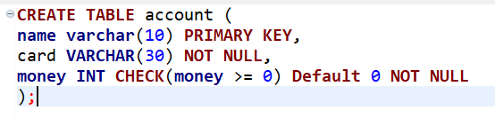
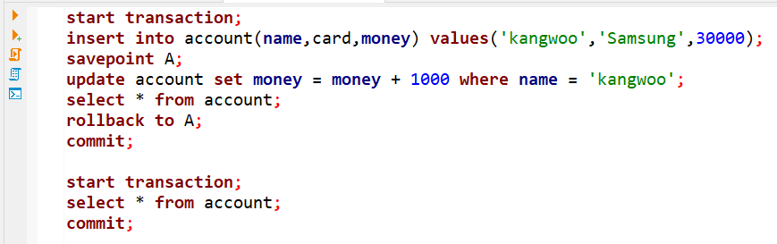
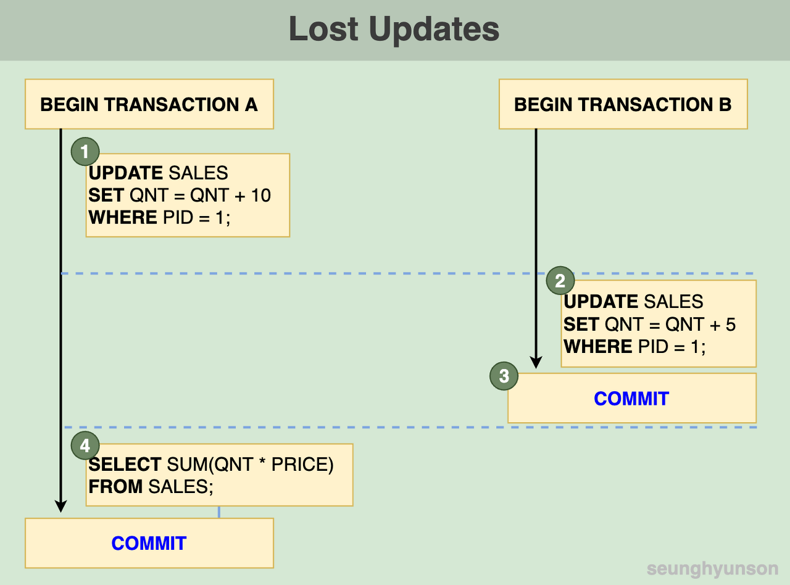
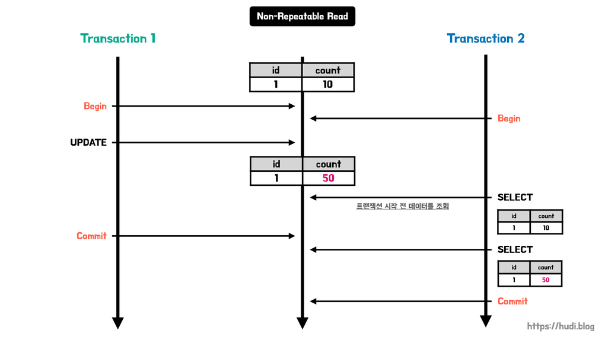

# 트랜젝션과 무결성

트랜잭션 : 논리적 기능을 수행하기 위한 작업의 단위 (현실에서의 행동을 하나로 묶는 행위)

### 트랜잭션의 상태 

ex) 은행에 갔을 때 돈을 빼는 과정

1. 신용카드를 넣고
2. 버튼을 누르고
3. 돈을 받는다

### 예시

1. 이름을 PK로 가지고, 카드사와 돈을 가지는 테이블을 생성. 

2. 3만원을 학생의 삼성카드로 입금하고,

트랜젝션 1 실행 후 SAVEPOINT A로 ROLLBACK

트랜젝션 2 실행 후

## TCL (Transaction Control Language)
- Commit : 변경된 내용을 영구저장
- ROLLBACK : 변경되기 이전의 상태로 되돌리기
- SAVEPOINT : 특정위치까지 영구저장 혹은 이전 상태로 만들 수 있도록 중간지점에 저장

## 트랜젝션의 4가지 특징 (ACID)

1. 원자성 (Atomicity)
트랜잭션안의 Statement가 전부 반영되거나, 아예 반영되지 않게 한다.
Commit : 전부 반영
Abort : 미 반영

2. 일관성 (Consistency) 
허용된 방식으로만 데이터를 변경해야 하는 것. 무결성 위반 시 ROLLBACK
Unique Constraint를 걸었는데 중복된 값이 들어올 경우
Check Constraint로 양수만 들어오게 설정했는데 계좌의 잔액이 음수가 될 경우

3. 격리성 (Isolation)
트랜잭션이 독립적으로 일어나는 것처럼 트랜잭션 수행 시 서로 연관되지 않고 끼어들지 못하는 것. 

4. 지속성, 영속성 (durability) 
프로그램이 종료된 후에도 커밋 시 영구적 반영, 디스크에 저장한다.

ex) 체크섬, 저널링

# 격리 수준 (Isolation Level)

## 1. READ Uncommited (커밋되지 않은 데이터 조회)

 

- T1에서 트랜잭션을 시작한다.
- T2에서 트랜잭션을 시작한다.
- T2에서 ID 1을 Select 문으로 조회한다 (10이 조회 된다)
- T1에서 id 1의 count를 50 으로 update한다.
- T2에서 ID 1을 Select 문으로 조회한다 (50이 조회 된다)
- T1, T2가 COMMIT

COMMIT되지 않은 데이터도 읽어오기 때문에 이러한 문제가 생긴다.

## 2. Read Commited (커밋된 데이터 조회)

Dirty Read를 보완하기 위해 COMMIT 되지 않는 데이터는 조회하지 않으면 Dirty Read 문제가 해결된다,

- T1과 T2에서 SALES 테이블의 QNT를 동시에 조회한다.
- T1에서 SALES의 QNT에 10을 더한다.
- T2에서 SALES의 QNT에 5를 더하고 커밋한다
- T2에서 커밋을 완료하였기 때문에 T1에서 QNT를 조회하면 T1의 이전 업데이트 내역이 손실된다.

커밋된 데이터만을 본다고 해도, 비슷한 시간대의 트랜잭션에서 UPDATE문으로 동일한 데이터를 수정한 뒤 COMMIT하면 현재 트랜잭션의 작업이 무의미해진다. 

비슷한 문제점으로, 한 트랜잭션에서 SELECT를 2번 할 때, 다른 데이터가 조회되는 경우이다.

## 3. Repeatable Read

LOST UPDATE를 방지하기 위해 TXN에 ID를 각각 부여해 자기보다 작은 ID의 트랜잭션에서 UPDATE한 것만 조회하며, 다른 트랜잭션의 백업본을 가지고 있어 부득이하게 조회 시, 백업본을 조회한다.

그러나 아직도 다른 트랜잭션에서 UPDATE가 아닌 INSERT 나 DELETE로 데이터를 삽입/삭제 후 COMMIT 시 동일한 트랜잭션에서 SELECT문이 실행 될 때마다 다른 값이 조회되는 PHANTOM READ 문제가 아직도 발생한다.

## 4. Serializable

PHANTOM READ를 방지하기 위해, 직렬화(Serializable)를 적용한다.
 모든 트랜잭션을 일렬로 줄세워 트랜잭션끼리의 간섭을 방지할 수 있다. 그러나 정렬과정하는 과정이 쉽지 않아 성능이 가장 떨어진다.

# 무결성

- 개체 무결성
- 참조 무결성
- 고유 무결성
- NULL 무결성