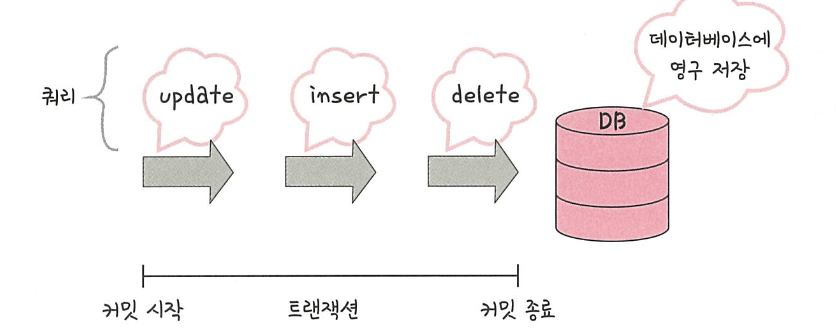
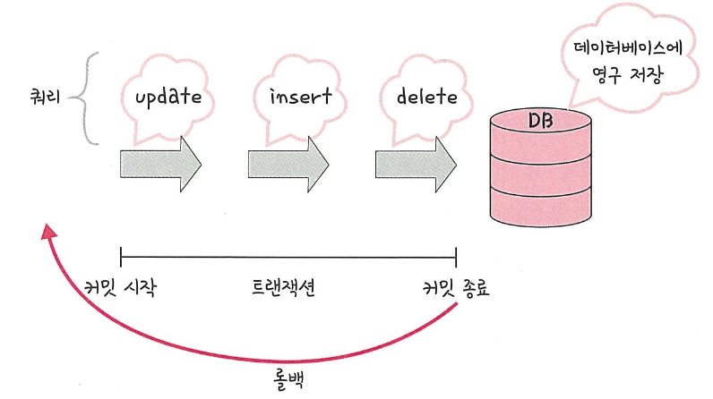
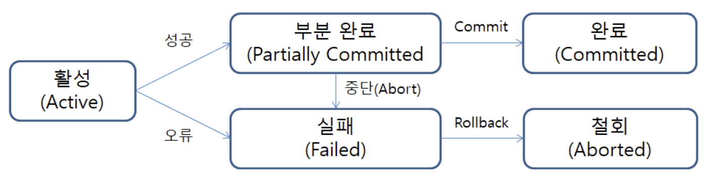
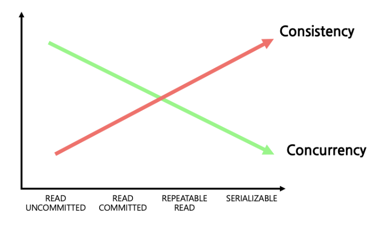
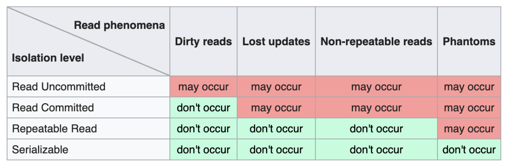
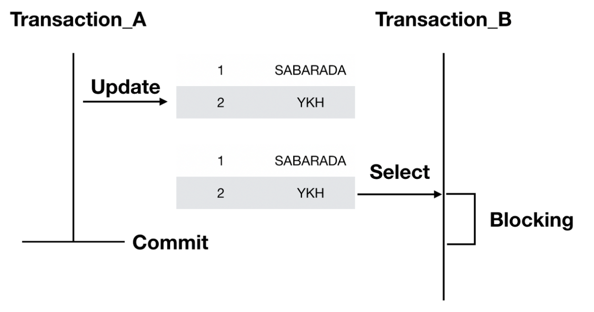
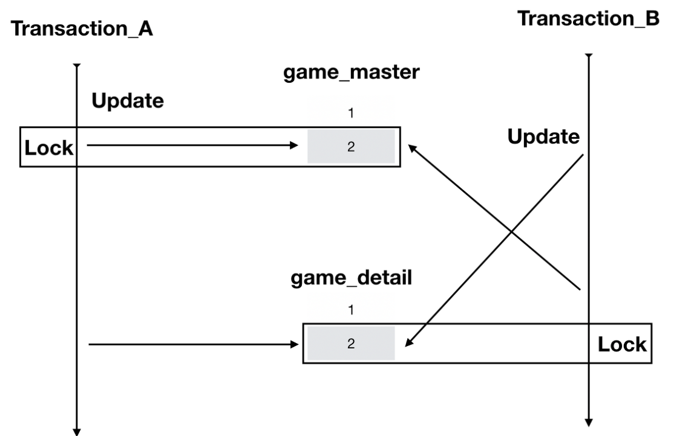

# 트랜잭션

## 1. 트랜잭션이란?
* DB에서 일어나는 연산의 집합
* DB의 상태를 일관되게 유지하기 위한 일련의 논리적 연산의 집합
* 하나의 논리적 기능을 수행하기 위한 작업의 단위
* 병행 제어 및 회복 작업의 논리적 작업 단위

## 2. 왜 트랜잭션을 사용하나?
위의 정의대로 트랜잭션은 논리적 연산의 집합이자 병행 제어 및 회복 작업의 단위이다.

연산의 집합을 작업의 단위로 설정함으로써 데이터베이스의 무결성이 훼손되는 경우에 작업 이전의 상태로 되돌릴 수 있다.

다시 말해 트랜잭션은 데이터베이스의 무결성을 보장하기 위해 사용된다.

## 3. 트랜잭션의 연산
트랜잭션의 연산에는 Commit과 Rollback이 있다.

이는 이후에 기술할 트랜잭션 특징 4가지 중 원자성 (Atomicity)와 관련이 깊다.

원자성은 트랜잭션 수행 시 모든 변경 사항이 반영되거나 혹은 하나도 반영되지 않아야 함을 의미한다.

데이터베이스에서는 아래의 연산으로 원자성을 보장한다.

### 3.1. Commit
Commit 연산은 데이터베이스 트랜잭션에서 수행된 모든 변경 사항을 영구히 반영하는 연산을 의미한다.

데이터베이스에는 AutoCommit 기능이 포함되어 있기도 하다.

AutoCommit은 쿼리문 수행 시 자동으로 Commit을 수행하게 되는데 일반적인 트랜잭션 수행 시에는 비활성화된다.

<div align='center'>
    <br>
</div>

### 3.2. Rollback
Rollback 연산은 데이터베이스 트랜잭션에서 수행된 모든 변경 사항을 취소하고 이전 상태로 되돌리는 연산을 의미한다.

<div align='center'>
    <br>
</div>

## 4. 트랜잭션의 상태
<div align='center'>
    <br>
</div>

데이터베이스에서 트랜잭션이 수행될 때는 위와 같은 5가지의 상태에 놓인다.

* 1. 활성
  * 트랜잭션이 시작되고 아무런 커밋이나 롤백이 이루어지지 않은 상태. 트랜잭션 내의 데이터베이스 연산을 수행함.
* 2. 부분 완료
  * 트랜잭션의 모든 연산이 완료 되고 커밋이 진행 중인 상태. 커밋이 모두 완료되기 전까지는 변경 사항이 반영되지 않음.
* 3. 완료
  * 트랜잭션이 완료되어 커밋된 상태. 모든 변경 사항이 영구적으로 반영됨. Rollback 수행 불가.
* 4. 실패
  * 트랜잭션 실행 중에 오류가 발생한 상태. Rollback을 수행함으로써 트랜잭션 이전의 상태로 복구.
* 5. 철회
  * 이전의 트랜잭션의 실패 혹은 명시적인 Rollback 명령을 통해 트랜잭션이 취소된 상태. 이전의 상태로 복구.

## 5. 트랜잭션의 특징 (ACID)
### 5.1. 원자성 (Atomicity)
"all or nothing"을 의미하는 특징.

트랜잭션에서의 작업은 모두 성공하거나 모두 실패하는 것을 의미한다.

트랜잭션에서는 내부의 작업이 실패한 경우 트랜잭션 전체의 실패로 간주하여 반영하지 않아야 한다.

### 5.2. 일관성 (Consistency)
트랜잭션은 수행되기 전과 후 항상 데이터베이스의 일관성을 보장해야 한다.

예로, 다른 사람에게 송금하는 과정을 트랜잭션으로 수행할 때 이전과 이후에 둘의 잔액 합이 달라지면 안된다.

### 5.3. 독립성, 격리성 (Isolation)
트랜잭션은 다른 트랜잭션과 독립적으로 실행되는 것처럼 보여야 한다.

여기서 보여야 한다고 한 이유는 실제로 트랜잭션은 다중 사용자 환경 아래에서 병행제어되기 때문이다.

독립성을 통해 사용자들은 일관성 있는 데이터에 접근 가능하다.

### 5.4. 지속성
트랜잭션이 성공적으로 완료되었을 경우 결과를 데이터베이스 영구적으로 반영해야 한다.

지속성은 시스템의 오류 혹은 외부적인 요소에 의해서도 트랜잭션의 결과는 유지되어야 한다는 의미이다.

지속성을 보장하기 위해서 트랜잭션의 로그 기록을 남기거나 시스템의 복구 매커니즘을 제공하기도 한다.

## 6. 격리 수준
격리 수준 (Isolation level) 이란 트랜잭션끼리 얼마나 고립되어 있는지를 나타내는 수준이다.

다시 말해 한 트랜잭션이 다른 트랜잭션의 데이터에 대한 접근 강도를 의미한다.

격리 수준이 높아질수록 트랜잭션간 독립성을 보장하지만 과도한 Locking으로 성능저하를 초래한다.

### 6.1. 격리 수준에 따른 현상
<div align='center'>
    <br>
</div>
격리 수준에 따라서 일관성과 동시성의 수준은 달라진다. 이로 인해 수준에 따라 아래와 같은 현상이 발생한다.

1. Dirty Read
> * 아직 커밋되지 않은 다른 트랜잭션의 데이터를 읽는 현상
1. Non-repeatable Read
> * 다른 트랜잭션이 수정한 데이터를 읽을 수 있는 현상.<br> 
> * 예시로 한 트랜잭션에서 동일한 쿼리로 2번 이상 조회할 때 다른 트랜잭션의 영향으로 결과가 상이한 경우.<br> 
> * 보통 데이터의 수정/삭제로 발생.
1. Phantom Read
> * 다른 트랜잭션이 삽입한 데이터를 읽을 수 있는 현상.<br>
> * 동일한 쿼리로 2번 이상 조회할 때 다른 트랜잭션의 영향으로 삽입된 레코드가 나타는 경우. <br>
> * 데이터의 삽입으로 발생

### 6.2. 격리 수준 종류

1. Read Uncommitted
> * 커밋하지 않은 데이터도 접근할 수 있는 격리 수준.
> * 가장 낮은 정합성을 가진 격리 수준이기 때문에 Dirty Read, Non-Repeatable Read, Phantom Read 모두 발생.
> * 권장하지 않는 격리 수준.

2. Read Committed
> * 커밋된 데이터만 조회할 수 있는 격리 수준.
> * 커밋을 기준으로 변경, 삭제, 삽입된 데이터에 접근할 수 있으므로 Non-Repeatable Read, Phantom Read 발생.
> * 최소 권장 격리 수준

3. Repeatable Read
> *  현재 트랜잭션 이전에 커밋된 내용만 조회할 수 있는 격리 수준.
> * 트랜잭션 수행 중 다른 트랜잭션에 의한 데이터 수정을 막아줌.
> * 데이터의 삽입은 막지 않기 때문에 Phantom Read 발생.

4. Serializable
> * 트랜잭션을 순차적으로 진행하는 격리 수준.
> * 최고 수준의 일관성을 가짐.
> * 과도한 Locking으로 성능이 떨어지며 DeadLock의 가능성이 있음.

<div align='center'>
    <br>
</div>

## 7. 동시성 제어 (Concurrency Control)
동시성 제어는 다중 사용자 환경에서 수행되는 다중 트랜잭션으로 인해 훼손되는 데이터베이스의 일관성과 무결성을 보호하는 방법을 말한다.

그렇다면 동시성 제어를 하지 않으면 어떤 현상이 발생할까?

1. 갱신 손실 (Lost Update)
> * 트랜잭션이 동일 데이터를 동시에 갱신할 경우 발생함.
> * 덮어쓰임에 의해 특정 트랜잭션의 갱신 내용이 반영되지 않음.
2. 현황파악오류 (Dirty Read)
> * 다른 트랜잭션이 작업 중인 중간 데이터를 읽을 때 발생함.
> * 잘못된 데이터를 읽어 트랜잭션의 수행결과에 오류가 발생할 수 있음.
3. 모순성 (Inconsistency)
> * 데이터에 대해 각각 갱신 전과 갱신 후의 값을 읽어 데이터의 불일치가 발생함.
4. 연쇄복귀 (Cascading Rollback)
> * 두 트랜잭션이 동일한 데이터 내용을 접근할 때 발생.
> * 한 트랜잭션의 실패로 Rollback 연산을 수행할 때 다른 트랜잭션이 해당 데이터를 읽을 수 있음.

### 7.1. 동시성 제어 기법 종류
#### 7.1.1. 로킹 기법 (Locking)
 트랜잭션이 사용하는 데이터 자원에 대해 상호 배제(Mutual Exclusive) 기능을 제공하는 기법을 말한다.

 트랜잭션은 Lock을 통해 데이터에 대한 독점적 접근이 가능하다.
  
* Lock의 종류
> 1. 공유 Lock (Shared Lock) :<br> 
> * 데이터를 읽을 때 사용되는 Lock
> * 공유 Lock은 같은 공유 Lock끼리는 읽기 접근을 허용하지만 베타 Lock의 접근은 허용하지 않음.
> 2. 전용 Lock (Exclusive Lock) : <br>
> * 데이터에 대한 읽기, 쓰기 모두 가능한 Lock.
> * 다른 트랜잭션의 읽기, 쓰기 접근을 모두 차단함.

이러한 로킹 기법에도 허점이 존재한다.

데이터에 대해 락을 걸거나 해제하는 시점에 제한이 없으면 그 과정에서도 일관성이 깨질 수 있기 때문이다.

이를 보완하기 위한 방법인 "2단계 로킹 규약" 이다.

* 블로킹 현상?
  * 전용 락에 의해 트랜잭션의 지연이 발생하는 현상.
  * 전용 락은 다른 트랜잭션의 접근을 차단하기 때문에 해제되기 전까지 다른 트랜잭션은 대기해야함.
<div align='center'>
    <br>
</div>

* 교착 상태? (Dead Lock)
  * 두 트랜잭션이 서로의 전용 락을 건 데이터에 접근할 때 발생하는 현상.
  * 서로가 락을 해제하지 않기 때문에 트랜잭션이 영원히 대기하게 됨.
  * 공유 락에서는 발생하지 않음.
<div align='center'>
    <br>
</div>

#### 7.1.2. 로킹 기법의 구현
실제 MySQL에서 로킹 기법이 어떻게 구현되는지 알아보자.

로킹 기법은 트랜잭션에 명시하지 않아도 데이터베이스의 격리수준에 따라 자동으로 처리 된다.

격리 수준은 위 내용대로 4가지가 존재하는데 다음과 같이 MySQL에서 설정할 수 있다.

```sql
-- READ UNCOMMITTED 격리 수준 설정
SET TRANSACTION ISOLATION LEVEL READ UNCOMMITTED;

-- READ COMMITTED 격리 수준 설정
SET TRANSACTION ISOLATION LEVEL READ COMMITTED;

-- REPEATABLE READ 격리 수준 설정
SET TRANSACTION ISOLATION LEVEL REPEATABLE READ;

-- SERIALIZABLE 격리 수준 설정
SET TRANSACTION ISOLATION LEVEL SERIALIZABLE;
```

세션 전체에 대해서 격리수준을 설정하고 싶다면 TRANSACTION 대신 SESSION을 작성하면 된다.

위와 같은 격리수준 설정으로 MySQL에서는 자동으로 로킹을 처리해주지만 명시적으로 설정할 수 있는 방법도 있다.

1. 로킹 함수
함수로 로킹을 설정하여서 특정 락을 설정, 해제함. (특정 작업에 대한 로킹)
```sql
-- 'my_lock'이라는 이름의 락을 설정
SELECT GET_LOCK('my_lock', 10); -- 락을 10초 동안 설정


-- 'my_lock'이라는 이름의 락을 해제
SELECT RELEASE_LOCK('my_lock');

-- 락을 설정한 후에는 다른 세션에서는 동일한 락을 획득할 수 없음
-- 락 획득에 성공하면 1, 실패하면 0을 반환
```

2. 쿼리문
쿼리문에 로킹에 대한 옵션을 작성함. (특정 데이터에 대한 로킹)

```sql
-- FOR SHARE : 공유 락
SELECT * FROM table_name WHERE condition FOR SHARE;

-- FOR UPDATE : 배타적 락
SELECT * FROM table_name WHERE condition FOR UPDATE;
```

쿼리문에 로킹 옵션을 작성하는 것은 특정 데이터에 대한 로킹을 설정한다.

이는 보통 MySQL에서 자동으로 설정해주기 때문에 세심한 관리가 필요하지 않다.

보통 작성자가 사용하게 되는 것은 로킹 함수인데 이는 특정 작업에 대한 로킹을 설정한다.

다음 예제를 보자.

```sql
-- 세션 1
START TRANSACTION;
SELECT GET_LOCK('chatroom_lock', 10); -- 'chatroom_lock' 락을 10초 동안 설정

INSERT INTO chat_messages (user_id, message) VALUES (1, 'Hello, everyone!');

COMMIT;
SELECT RELEASE_LOCK('chatroom_lock'); -- 'chatroom_lock' 락 해제

-- 세션 2
START TRANSACTION;
SELECT GET_LOCK('chatroom_lock', 10); -- 'chatroom_lock' 락을 10초 동안 설정

INSERT INTO chat_messages (user_id, message) VALUES (2, 'How are you?');

COMMIT;
SELECT RELEASE_LOCK('chatroom_lock'); -- 'chatroom_lock' 락 해제
```

위 예제는 채팅방에 데이터를 삽입하는 예제이다. 트랜잭션들은 데이터를 삽입하기 위해 'chatroom_lock' 이라고 하는 사용자 정의 락을 획득해야 한다.

다시 말해, chatroom_lock은 일관성을 보장해야 하는 작업을 위한 락이다.

세션 1의 트랜잭션이 먼저 'chatroom_lock'을 획득하면 해제하기 전까지는 세션 2가 작업하지 못하게 되는 것이다.


#### 7.1.2. 타임 스탬프 (Time Stamp)
내용 추가 예정
#### 7.1.3. 낙관적 검증 기법
내용 추가 예정
#### 7.1.4. MVCC (다중버전 동시성 제어 기법)
내용 추가 예정